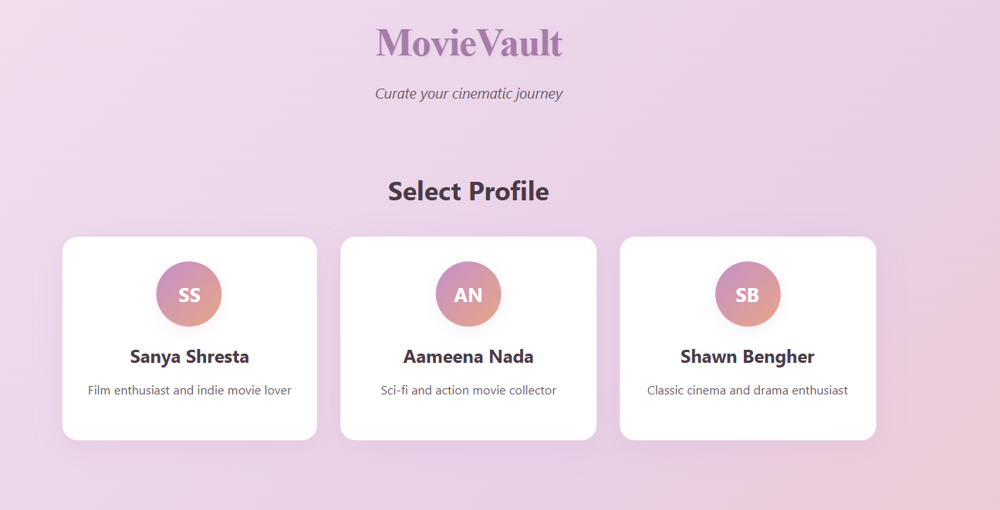
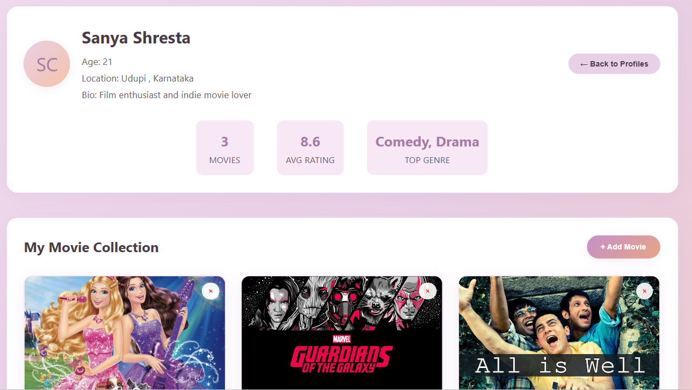

# 🎬 MovieVault

An interactive movie collection app for multiple users built with **HTML**, **CSS**, and **Vanilla JavaScript**. Users can browse their profiles, explore movies, and add or remove titles from their personalized watchlist. Clean UI, dynamic DOM updates, and genre-rich visuals—all in one lightweight web app.

## 🚀 Live Demo

- 🌐 **Live Site URL**: [View it in action](https://movie-gallery-app.vercel.app/)
- 💻 **Solution URL**: [See the code](https://github.com/SanyaShresta25/Movie-Gallery-App)

## 📸 Screenshot

## 📐 Built With

- ✅ Semantic **HTML5**
- 🎨 **CSS3** for responsive, card-based layout
- 🧠 **Vanilla JavaScript** for interactivity and state management
- 📱 Mobile-friendly and cross-browser compatible

## ✨ Features

- 👥 Multi-user login simulation
- 📝 Profile info display (name, age, bio, avatar, location, favorite genres)
- 🎞️ Movie cards with title, director, year, rating, and poster
- ➕ Add new movies dynamically with form validation
- ❌ Delete movies with confirmation
- 📊 Auto-calculated average rating and total movies per user
- 🧭 Clean navigation between user selector and movie dashboard

## 🧠 What I Learned

- DOM manipulation and dynamic rendering of elements
- Maintaining per-user state and updating data accordingly
- Validating form inputs and restricting invalid entries
- Designing for usability: empty states, error handling, visual feedback
- Managing arrays and nested data structures

## 🔄 Continued Development

- 🔍 Add movie search/filtering by genre or title
- 💾 Persist data using localStorage or Firebase
- 🌓 Theme toggle (light/dark mode)
- 🧠 Add user authentication and database connection
- 🧩 Build a backend API with Express.js for real-time updates

## 📚 Useful Resources

- [MDN Web Docs - Working with the DOM](https://developer.mozilla.org/en-US/docs/Web/API/Document_Object_Model)
- [JavaScript Info - Event Handling](https://javascript.info/events)
- [CSS Flexbox vs Grid](https://css-tricks.com/flexbox-vs-css-grid/)

## 👩‍💻 Author

- **Portfolio** – [Sanya Shresta Jathanna](https://sanyashresta.netlify.app/)
- **GitHub** – [@SanyaShresta25](https://github.com/SanyaShresta25)

## 🙏 Acknowledgments

- Thanks to the dev community for resources and inspiration.
- Movie poster GIFs and cover art courtesy of [Pinterest](https://pinterest.com).
- UI design inspired by card-based dashboards and media libraries.

---

🎞️ *Curate your own cinematic universe. User by user. Film by film.*
